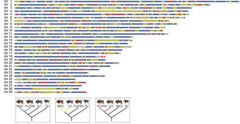

```{r setup, include = FALSE}
library(tidyverse)
library(RColorBrewer)
library(knitr)
```

<!-- adding bold and italic options -->
<style>
em {
  font-style: italic
}
strong {
  font-weight: bold;
}
</style>

## Museum samples in conservation genetics

**How useful are museum samples?**

- Convenient and ethical
- Rare and extinct species
- A genetic time machine

**What are the challenges?**

- DNA preservation
- Lab methods
- Sample metadata
- Timescale

**Case studies**

--- .segue .dark 

## How useful are museum samples?

--- bg:black

```{r, out.width = "100%", dpi = 300, echo = FALSE, fig.align = "center", fig.cap=""}
  include_graphics("./assets/img/Berlin.svg")
```

--- &twocol

## Convenient and ethical

*** =left

**Less admin burden**

- No landowner permission
- No live sampling
- Generally exempt from Nagoya protocol

**Ethical**

- No disturbance
- No injury

**Convenient**

- Reduce fieldwork cost
- Reduce carbon footprint

*** =right

```{r, out.width = "65%", dpi = 300, echo = FALSE, fig.align = "center", fig.cap=""}
  include_graphics("./assets/img/Strigops_habroptilus_(taxidermied)_at_Göteborgs_Naturhistoriska_Museum_8581.jpg")
```

---

## Rare, extinct, or difficult to sample species

```{r, out.width = "100%", dpi = 300, echo = FALSE, fig.align = "center", fig.cap=""}
  
```

---

## Rare, extinct, or difficult to sample species

```{r, out.width = "75%", dpi = 300, echo = FALSE, fig.align = "center", fig.cap=""}
  
```

--- &thirds

## Rare, extinct, or difficult to sample species

*** =left

```{r, out.width = "100%", dpi = 300, echo = FALSE, fig.align = "center", fig.cap=""}
  include_graphics("./assets/img/Berlin_VBB_single_ticket_258345.jpg")
```

*** =right

```{r, out.width = "100%", dpi = 300, echo = FALSE, fig.align = "center", fig.cap=""}
  
```

--- bg:white

## A genetic time machine

```{r, out.width = "90%", dpi = 300, echo = FALSE, fig.align = "center", fig.cap=""}
  include_graphics("./assets/img/time_mach.svg")
```

---

## A genetic time machine

```{r, out.width = "80%", dpi = 300, echo = FALSE, fig.align = "center", fig.cap=""}
  include_graphics("./assets/img/planta2.JPG")
```

--- .segue .dark 

## What are the challenges?

---

## Sample types

### Methods are less advanced for museum than for ancient samples

**Bone/teeth**

- Probably most reliable and predictable

**Skin/pelt/feathers**

- Typically treated with unknown chemical mixture
- Potentially cross contamination within museum

**Wet collection**

- May be formalin fixed
- Stored in an alcohol, type/concentration often unknown

---

## DNA properties

```{r mad, out.width = "100%", out.height=500, dpi = 300, echo = FALSE, fig.cap=""}
  include_graphics("./assets/img/Straube et al. - Unknown - Successful application of ancient DNA extraction and library construction protocols to museum wet collection.pdf")
```

--- bg:white

## DNA yield 

```{r, out.width = "100%", dpi = 300, echo = FALSE, fig.align = "center", fig.cap=""}
  include_graphics("./assets/img/yield.svg")
```

---

## DNA yield

```{r, out.width = "70%", dpi = 300, echo = FALSE, fig.align = "center", fig.cap=""}
  
```

---

## DNA fragmentation

```{r, out.width = "65%", dpi = 300, echo = FALSE, fig.align = "center", fig.cap=""}
  
```

---

## DNA extraction method

```{r, out.width = "100%", dpi = 300, echo = FALSE, fig.align = "center", fig.cap=""}
  
```

---

## DNA content

```{r, out.width = "100%", dpi = 300, echo = FALSE, fig.align = "center", fig.cap=""}
  include_graphics("./assets/img/berlin_kings.svg")
```

--- &twocol

## Sample metadata

*** =left

```{r, out.width = "71%", dpi = 300, echo = FALSE, fig.align = "center", fig.cap=""}
  include_graphics("./assets/img/pardus_mfn.JPG")
```

```{r, out.width = "71%", dpi = 300, echo = FALSE, fig.align = "center", fig.cap=""}
  
```

*** =right

```{r, out.width = "85%", dpi = 300, echo = FALSE, fig.align = "center", fig.cap=""}
  
```

---

## Timescale

```{r, out.width = "100%", dpi = 300, echo = FALSE, fig.align = "center", fig.cap=""}
  
```

---

## Timescale: genetic diversity

```{r, out.width = "100%", dpi = 300, echo = FALSE, fig.align = "center", fig.cap=""}
  include_graphics("./assets/img/Ho.svg")
```

---

## Timescale: population divergence

```{r, out.width = "100%", dpi = 300, echo = FALSE, fig.align = "center", fig.cap=""}
  include_graphics("./assets/img/Fst.svg")
```

--- .segue .dark 

## Case studies

--- &twocol

## Zimbabwe rinkhals

*** =left

- Small spitting cobra
- Allopatric Zimbabwe population
- Currently *Hemachatus haemachatus*
- "Small cobra" known since 1920's
- First specimen identified in 1960's
- Last seen in 1988
- Handful of museum specimens
- Formalin fixed stored in alcohol
- Mitochondrial capture


*** =right

```{r, out.width = "100%", out.height=500, dpi = 300, echo = FALSE, fig.cap=""}
  include_graphics("./assets/img/hema.svg")
```

--- bg:white

## Zimbabwe rinkhals

```{r, out.width = "110%", out.height=500, fig.align='center', dpi = 300, echo = FALSE, fig.cap=""}
  include_graphics("./assets/img/hema2.svg")
```

--- bg:white

## Zimbabwe rinkhals

```{r, out.width = "100%", out.height=500, fig.align='left', dpi = 300, echo = FALSE, fig.cap=""}
  
```

---

## Zimbabwe rinkhals

```{r, out.width = "100%", out.height=500, dpi = 300, echo = FALSE, fig.cap=""}
  include_graphics("./assets/img/Major et al. - 2023 - Museum DNA reveals a new, potentially extinct species of rinkhals (Serpentes Elapidae Hemachatus).pdf")
```

--- &twocol

## White rhinos

*** =left

- Two subspecies: northern and southern
- ~20,000 southern white rhinos (in 2015)
- Northern white rhino functionally extinct (2 females left in 2018)

```{r, out.width = "65%", dpi = 300, echo = FALSE, fig.align='center', fig.cap=""}
include_graphics("./assets/img/rhin_map.svg")
```

*** =right

```{r, out.width = "60%", dpi = 300, echo = FALSE, fig.align='center', fig.cap=""}
include_graphics("./assets/img/1920px-Ceratotherium_simum_(21922261908).jpg")
```

```{r, out.width = "75%", dpi = 300, echo = FALSE, fig.align='center', fig.cap=""}
include_graphics("./assets/img/rhin_demo.svg")
```

---

## Runs of homozygosity (ROH)

- Chromosome regions are identical by descent
- Can be calculated from pedigrees
- Genome sequencing allows identification of **runs of homozygosity (ROH)**

```{r, out.width = "75%", dpi = 300, echo = FALSE, fig.align = "center", fig.cap=""}
  
```

--- bg:white

## Runs of homozygosity (ROH)

- Total inbreeding = ROH content or FROH
- Recent = long ROH
- Older = short ROH

```{r, out.width = "95%", fig.width = 8, fig.height = 3, dpi = 300, echo = FALSE, fig.align='center', fig.cap=""}
my_roh_hi <- jitter(c(rep(0.0013, times=100)), factor=5)
my_roh_lo <- jitter(c(rep(0.0000000001, times=100)), factor=6)
my_roh <- c(my_roh_hi, my_roh_lo, my_roh_lo, my_roh_hi, my_roh_hi, my_roh_hi, my_roh_lo, my_roh_hi, my_roh_hi, my_roh_hi)

plot(c(1:1000), my_roh, type="l", 
ylim=c(0,0.0015), axes=FALSE, frame.plot=TRUE,
xlab="Chromosome position (Mb)", ylab="Het sites/kb",
main=""
)

axis(1, at=c(0,200,400,600,800,1000), labels=c("0","20","40","60","80","100"), las=1)
axis(2, at=c(0,0.0005,0.001,0.0015), labels=c("0","0.5","1.0","1.5"), las=2)
```

---

## White rhinos

```{r, out.width = "100%", dpi = 300, echo = FALSE, fig.align='center', fig.cap=""}
include_graphics("./assets/img/rhin_res.svg")
```

---

## White rhinos

```{r, out.width = "100%", out.height=500, dpi = 300, echo = FALSE, fig.cap=""}
  include_graphics("./assets/img/Sánchez-Barreiro et al. - 2021 - Historical population declines prompted significant genomic erosion in the northern and southern white.pdf")
```

--- &twocol

## Wisent (European bison)

*** =left

- Lowland wisent *B. b. bonasus*
- Caucasian wisent *B. b. caucasicus*
- Last wild animal shot in 1927
- Captive population: 
  - ~11 lowland
  - 1 Caucasian
- Breeding programme
  - L line **"pure"**
  - LC line **mixed**
- Genome sequencing:
  - 2 lowland founders
  - 2 Caucasian
  - Modern L and LC

*** =right

```{r, out.width = "100%", dpi = 300, echo = FALSE, fig.align='center', fig.cap=""}
include_graphics("./assets/img/bisons.png")
```

```{r, out.width = "100%", dpi = 300, echo = FALSE, fig.align='center', fig.cap=""}
include_graphics("./assets/img/planta2.JPG")
```

--- bg:white

## Genome map

```{r, out.width = "100%", dpi = 300, echo = FALSE, fig.align='center', fig.cap=""}

```

--- bg:white

## Wisent admixture

```{r, out.width = "85%", dpi = 300, echo = FALSE, fig.align='center', fig.cap=""}
include_graphics("./assets/img/bison_admix.svg")
```

---

## Museum samples in conservation genetics

- A convenient and ethical option
- Unique opportunity to sample the past
- Issues with sample preservation and metadata
- Issues with timescale
- Lab methods still need refinement

### Can be a very effective and useful tool in conservation genetics!

--- &thankyou

## Thanks all! :)
