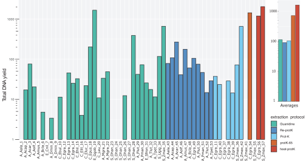
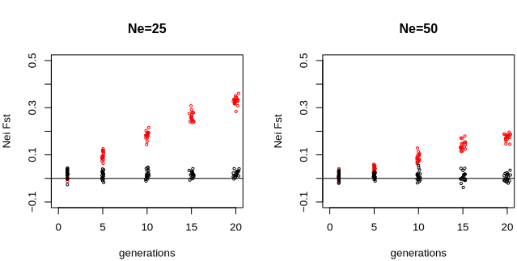
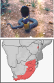
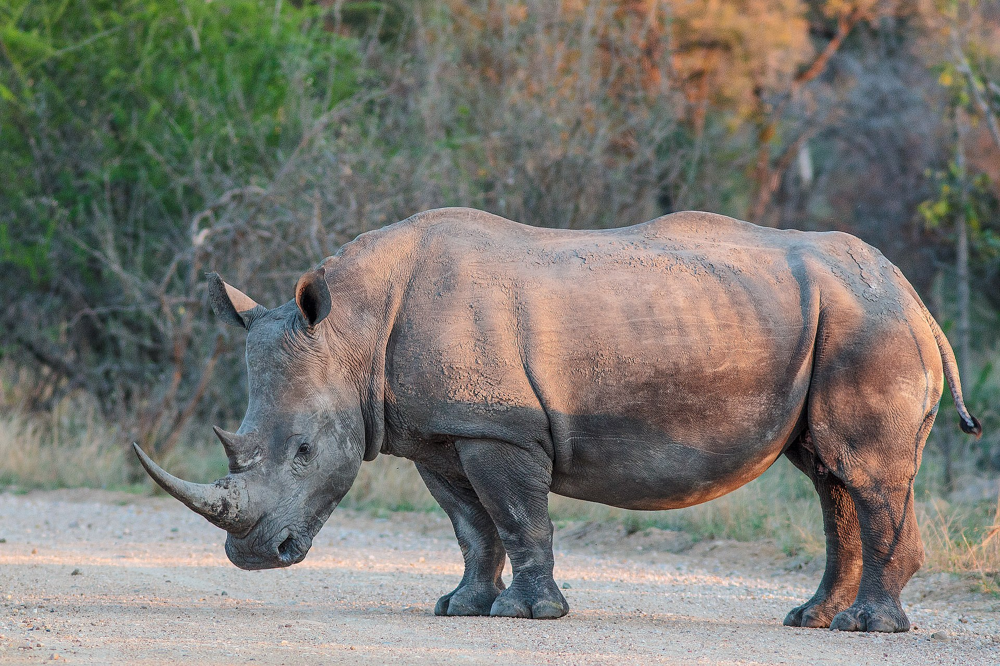
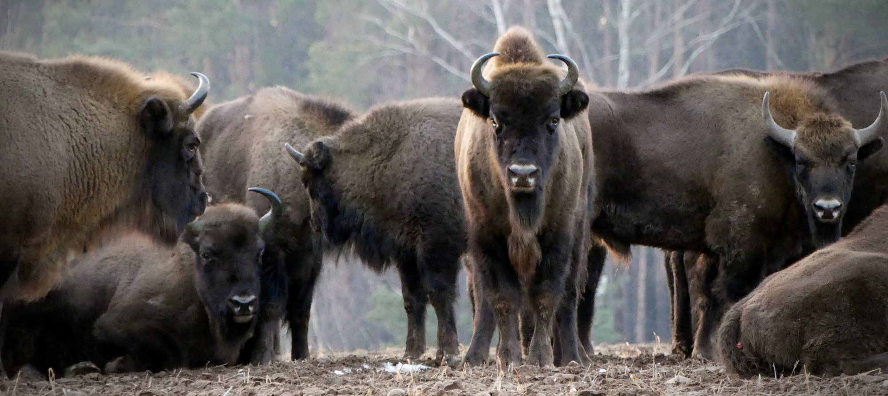

<!-- adding bold and italic options -->

## Museum samples in conservation genetics

**How useful are museum samples?**

- Convenient and ethical
- Rare and extinct species
- A genetic time machine

**What are the challenges?**

- DNA preservation
- Lab methods
- Sample metadata
- Timescale

**Case studies**

--- .segue .dark 

## How useful are museum samples?

--- bg:black

--- &twocol

## Convenient and ethical

*** =left

**Less admin burden**

- No landowner permission
- No live sampling
- Generally exempt from Nagoya protocol

**Ethical**

- No disturbance
- No injury

**Convenient**

- Reduce fieldwork cost
- Reduce carbon footprint

*** =right

---

## Rare, extinct, or difficult to sample species

---

## Rare, extinct, or difficult to sample species

--- &thirds

## Rare, extinct, or difficult to sample species

*** =left

*** =right

--- bg:white

## A genetic time machine

---

## A genetic time machine

--- .segue .dark 

## What are the challenges?

---

## Sample types

### Methods are less advanced for museum than for ancient samples

**Bone/teeth**

- Probably most reliable and predictable

**Skin/pelt/feathers**

- Typically treated with unknown chemical mixture
- Potentially cross contamination within museum

**Wet collection**

- May be formalin fixed
- Stored in an alcohol, type/concentration often unknown

---

## DNA properties

<embed src="./assets/img/Straube et al. - Unknown - Successful application of ancient DNA extraction and library construction protocols to museum wet collection.pdf" width="100%" height="500" type="application/pdf" />

--- bg:white

## DNA yield 

---

## DNA yield

---

## DNA fragmentation

---

## DNA extraction method

---

## DNA content

--- &twocol

## Sample metadata

*** =left

*** =right

---

## Timescale

---

## Timescale: genetic diversity

---

## Timescale: population divergence

--- .segue .dark 

## Case studies

--- &twocol

## Zimbabwe rinkhals

*** =left

- Small spitting cobra
- Allopatric Zimbabwe population
- Currently *Hemachatus haemachatus*
- "Small cobra" known since 1920's
- First specimen identified in 1960's
- Last seen in 1988
- Handful of museum specimens
- Formalin fixed stored in alcohol
- Mitochondrial capture

*** =right

--- bg:white

## Zimbabwe rinkhals

--- bg:white

## Zimbabwe rinkhals

---

## Zimbabwe rinkhals

<embed src="./assets/img/Major et al. - 2023 - Museum DNA reveals a new, potentially extinct species of rinkhals (Serpentes Elapidae Hemachatus).pdf" width="100%" height="500" type="application/pdf" />

--- &twocol

## White rhinos

*** =left

- Two subspecies: northern and southern
- ~20,000 southern white rhinos (in 2015)
- Northern white rhino functionally extinct (2 females left in 2018)

*** =right

---

## Runs of homozygosity (ROH)

- Chromosome regions are identical by descent
- Can be calculated from pedigrees
- Genome sequencing allows identification of **runs of homozygosity (ROH)**

--- bg:white

## Runs of homozygosity (ROH)

- Total inbreeding = ROH content or FROH
- Recent = long ROH
- Older = short ROH

---

## White rhinos

---

## White rhinos

<embed src="./assets/img/Sánchez-Barreiro et al. - 2021 - Historical population declines prompted significant genomic erosion in the northern and southern white.pdf" width="100%" height="500" type="application/pdf" />

--- &twocol

## Wisent (European bison)

*** =left

- Lowland wisent *B. b. bonasus*
- Caucasian wisent *B. b. caucasicus*
- Last wild animal shot in 1927
- Captive population: 
  - ~11 lowland
  - 1 Caucasian
- Breeding programme
  - L line **"pure"**
  - LC line **mixed**
- Genome sequencing:
  - 2 lowland founders
  - 2 Caucasian
  - Modern L and LC

*** =right

--- bg:white

## Genome map

--- bg:white

## Wisent admixture

---

## Museum samples in conservation genetics

- A convenient and ethical option
- Unique opportunity to sample the past
- Issues with sample preservation and metadata
- Issues with timescale
- Lab methods still need refinement

### Can be a very effective and useful tool in conservation genetics!

--- &thankyou

## Thanks all! :)
